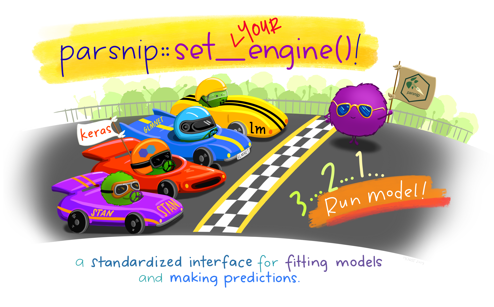

---
output:
  xaringan::moon_reader:
    lib_dir: libs
    css: xaringan-themer.css
    nature:
      highlightStyle: github
      highlightLines: true
      countIncrementalSlides: false
---

background-image: url(img/portada.png)
background-size: cover
class: animated slideInRight fadeOutLeft, middle

```{r xaringan-extra-styles, include=FALSE}
xaringanExtra::use_extra_styles(
  hover_code_line = TRUE,         #<<
  mute_unhighlighted_code = TRUE  #<<
)
```


```{r include=FALSE}
library(countdown)
```

```{r setup, include=FALSE}
options(htmltools.dir.version = FALSE)
```

```{r xaringan-themer, include=FALSE, warning=FALSE}
library(xaringanthemer)
style_duo_accent(
  primary_color = "#6c5396",
  secondary_color = "#534173",
  inverse_header_color = "#FFFFFF"
)
```
  
```{r , message=FALSE, warning=FALSE, include=FALSE} 
library(fontawesome)
library(emo)
library(tidyverse)
```

```{r xaringan-logo, echo=FALSE}
xaringanExtra::use_logo("img/logo-tidymodels.png")
```


```{r xaringan-tachyons, echo=FALSE}
xaringanExtra::use_tachyons()
xaringanExtra::use_fit_screen()
```


# Regresión


### 1º Congreso Latinoamericano de Mujeres en Bioinformática y Ciencia de Datos

---
### Regresión

La variable de respuesta $Y$ es numérica.

Por ejemplo:

* Nivel salinidad marina.
* Temperatura media.
* Precio de una casa.
* Salario mínimo.
* Precio dólar blue.

---
## Nuestros pingüinos `r emo::ji("penguin")`

### Ingreso los datos 

```{r message=FALSE, warning=FALSE}
library(tidymodels) 
library(datos)

dataset <- pinguinos %>%
  drop_na() %>% #elimino valores perdidos
  select(-anio,-sexo, -isla) #elimino columnas q no son numéricas
glimpse(dataset)
```

---
## Analizamos:

Relación entre variables continuas: ancho y largo de pico

```{r out.width="50%"}
ggplot(dataset,aes(largo_pico_mm,alto_pico_mm)) +
  geom_point()
```
???
No observamos correlación
---
## Analizamos:

La relación entre variables continuas: peso y largo de alas

```{r out.width="50%" }
ggplot(dataset,aes(largo_aleta_mm,masa_corporal_g)) +
  geom_point()
```


---
## Correlación

Observamos una mayor correlación entre el peso y el largo de las alas.

```{r}
cor(dataset$largo_aleta_mm,dataset$masa_corporal_g)
```

```{r}
cor(dataset$largo_aleta_mm,dataset$alto_pico_mm)
```

```{r}
cor(dataset$largo_pico_mm,dataset$masa_corporal_g)
```

---


background-image: url(img/penguin2.jpg)
background-size: cover
class: inverse, animated slideInRight fadeOutLeft, middle

### Pregunta - Hipótesis

* ¿Es posible predecir el peso del pingüino a partir de la medición de la aleta?

* ¿Es posible predecir el peso del pingüino a partir de otras mediciones?

---
## Vamos a dividir el set de datos 

```{r split, cache=TRUE}
set.seed(123) # <- muy importante
p_split <- dataset %>%
  initial_split(prop=0.75)

p_train <- training(p_split)
p_test  <- testing(p_split)
p_split

```


Estos son los datos de entrenamiento/prueba/total 

* __Vamos a _entrenar_ con 250 muestras__
* __Vamos a _validar_ con 83 muestras__
* __Datos totales: 333__

---
## Modelos lineales

* ¿Cuántos modelos lineales para regresión conoces? 
* ¿ O cuántas implementaciones de modelo lineal?

Por ejemplo, librerías como:
* lm
* glm
* stan
* keras


```{r echo=FALSE, out.width = '80%',  fig.align='center'}

```

---
## Modelo lineal lm

```{r  cache=TRUE}
lm_spec <- linear_reg() %>%
  set_engine(engine = "lm")
lm_spec
```

---
## Modelo lineal lm


```{r  cache=TRUE}
set.seed(123)
lm_fit <- lm_spec %>%
  fit(largo_aleta_mm ~ masa_corporal_g,
    data = p_train
  )

lm_fit
```

---
## Ejercicio 1

Chequea que el resultado anterior es igual a usar un modelo lm()


```{r cache=TRUE,eval=FALSE}
set.seed(123)
lm(largo_aleta_mm ~ masa_corporal_g,
    data = p_train)
```


`r countdown(minutes = 0, seconds = 30)`
---
## Ejercicio 1 - respuesta

Chequea que el resultado anterior es igual a usar un modelo lm()


```{r cache=TRUE}
set.seed(123)
lm(largo_aleta_mm ~ masa_corporal_g,
    data = p_train)
```


---
## Todo junto

```{r}
set.seed(123)
lm_fit <- linear_reg() %>%
  set_engine(engine = "lm") %>%
  fit(largo_aleta_mm ~ masa_corporal_g,
    data = p_train
  )

```

---
## Todo nuestro análisis

```{r todojunto1, cache=TRUE}
set.seed(100) # Importante
p_split  <- initial_split(dataset, prop=0.75) 
p_train  <- training(p_split)
p_test   <- testing(p_split)

lm_fit      <- lm_spec %>% 
                fit(masa_corporal_g ~ largo_aleta_mm,
                    data = p_train)

predicho  <- lm_fit %>% 
                predict(new_data = p_test) %>% 
                mutate(verdadero = p_test$masa_corporal_g)
rmse(predicho, truth = verdadero,estimate=.pred)

```

---
## Root Mean Standard Error 


$RMSE = \sqrt{ \frac{1}{N}\sum_{i=1}^{N} ( y_{pred_i} - y_{i})^2}$

```{r}
rmse(predicho, truth = verdadero,estimate=.pred)
mae(predicho, truth = verdadero,estimate=.pred)
```
$mae = (\frac{1}{n})\sum_{i=1}^{n}\left | y_{i} - x_{i} \right|$
---
### Graficando el modelo lineal

```{r out.width="70%",echo=FALSE,message=FALSE}
ggplot(dataset,aes(largo_aleta_mm , masa_corporal_g)) +
  geom_point() +
  geom_smooth(method = "lm",)
```

---
## Ejercicio 2

¿Podemos mejorar el desempeño del modelo agregando más variables?

Modifica la fórmula de lm agregando las variables
* largo_pico_mm
* alto_pico_mm
* largo_aleta_mm

¿Mejora el error (RMSE) ?

`r countdown(minutes = 1, seconds = 00)`
---
## Ejercicio 2 - respuesta

```{r todojunto2, cache=TRUE}
set.seed(100) # Importante
p_split  <- initial_split(dataset, prop=0.75) 
p_train  <- training(p_split)
p_test   <- testing(p_split)

lm_fit_all      <- lm_spec %>% 
                fit(masa_corporal_g ~ largo_pico_mm +alto_pico_mm+largo_aleta_mm,
                    data = p_train)

peso_pred_all  <- lm_fit_all %>% 
                predict(new_data = p_test) %>% 
                mutate(verdadero = p_test$masa_corporal_g)
rmse(peso_pred_all, truth = verdadero,estimate=.pred)
```
---
### Modelo lm para varias variables de entrada
```{r}
lm_fit_all
```

---
background-image: url(img/rf-fondo.png)
background-size: cover

### Random Forest

```{r rf_spec, cache=TRUE}
rf_spec <- rand_forest(mode = "regression") %>%  #<-
  set_engine("ranger")
rf_spec

```

---
background-image: url(img/rf-fondo.png)
background-size: cover

### Random Forest

```{r}
set.seed(123)
rf_fit <- rf_spec %>%
  fit(masa_corporal_g ~ largo_pico_mm +alto_pico_mm + largo_aleta_mm,
    data = p_train)

rf_fit

```

---
background-image: url(img/rf-fondo.png)
background-size: cover

## Random forest

```{r}
rf_fit %>% 
                predict(new_data = p_test) %>% 
                mutate(verdadero = p_test$masa_corporal_g)
```
---
background-image: url(img/rf-fondo.png)
background-size: cover

## Random forest

```{r}
peso_pred_rf <- rf_fit %>% 
                predict(new_data = p_test) %>% 
                mutate(verdadero = p_test$masa_corporal_g)
rmse(peso_pred_rf, truth = verdadero,estimate=.pred)
```

---
background-image: url(img/rf-fondo.png)
background-size: cover

```{r todojunto3}
peso_pred_rf  <- rf_fit %>% 
                predict(new_data = p_test) %>% 
                mutate(verdadero = p_test$masa_corporal_g)
rmse(peso_pred_rf, truth = verdadero,estimate=.pred)
```
---
## Comparando desempeño 
en el conjunto de entrenamiento

```{r}
results_train <- lm_fit_all %>%
  predict(new_data = p_train) %>%
  mutate(
    verdadero = p_train$masa_corporal_g,
    model = "lm"
  ) %>%
  bind_rows(rf_fit %>%
    predict(new_data = p_train) %>%
    mutate(
      verdadero = p_train$masa_corporal_g,
      model = "rf"
    ))
```

---
## Resultados conjunto entrenamiento 

```{r}
results_train %>%
  group_by(model) %>%
  rmse(truth = verdadero, estimate = .pred)
```

---
background-image: url(img/dt-fondo.png)
background-size: cover

### Ejercicio 3 

.bg-near-white.b--purple.ba.bw2.br3.shadow-5.ph4.mt5[
#### Compare el rendimiento de los modelos en el conjunto de datos de testeo.
Copie y pegue el código anterior. 
Modifique lo necesario.
]

`r countdown(minutes = 1, seconds = 00)`

---

## Comparando modelos en el testeo

```{r}
results_test <- lm_fit_all %>%
  predict(new_data = p_test) %>%
  mutate(
    verdadero = p_test$masa_corporal_g,
    model = "lm"
  ) %>%
  bind_rows(rf_fit %>%
    predict(new_data = p_test) %>%
    mutate(
      verdadero = p_test$masa_corporal_g,
      model = "rf"
    ))
```

```{r}
results_test %>%
  group_by(model) %>%
  rmse(truth = verdadero, estimate = .pred)
```
---
### FIN apartado :-) 

* Muchas gracias
* Recreo